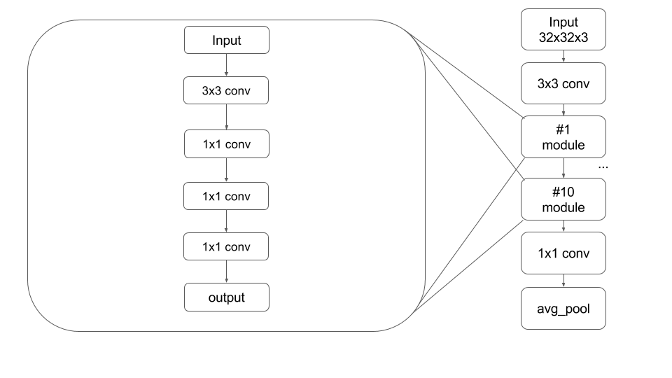

# Network Test

* 모델 코드를 제외한 테스트를 위한 코드들은 http://cs231n.github.io/ 에서 참조하여 작성하였습니다.

* 각각 모델.docx 에서는 각 네트워크에서 쓰인 레이어와 training time 및 training, validation, test 각각의 loss, accuracy를 확인 할 수 있습니다.

## Convolution neural networks

* Dataset은 CIFAR-10을 사용하였습니다.

* CIFAR10_test.ipynb 파일을 통하여 test를 진행하였습니다. 
 
  [Networks Summary](https://cdn.rawgit.com/pokem1402/cs231n/63017e59/Network%20Test/html/Test%20Network%20Idea%20Performance.html) 
  
  [Inception ver1](https://cdn.rawgit.com/pokem1402/cs231n/63017e59/Network%20Test/html/Inception%20model%20v1.html)
  
    
  [Inception ver2](https://cdn.rawgit.com/pokem1402/cs231n/63017e59/Network%20Test/html/Inception%20model%20v2.html)
  
    
  [Inception ver3](https://cdn.rawgit.com/pokem1402/cs231n/63017e59/Network%20Test/html/Inception%20model%20v3.html)
  
    
  [Inception ver3_batch](https://cdn.rawgit.com/pokem1402/cs231n/63017e59/Network%20Test/html/Inception%20model%20v3_batch.html)
  
    
  [Inception ver4](https://cdn.rawgit.com/pokem1402/cs231n/63017e59/Network%20Test/html/Inception%20model%20v4.html)
  
    
  [Network In Network ver1](https://cdn.rawgit.com/pokem1402/cs231n/63017e59/Network%20Test/html/NIN%20v1.html)
  
    
  [Network In Network ver2](https://cdn.rawgit.com/pokem1402/cs231n/63017e59/Network%20Test/html/NIN%20v2.html)
  
  
  [Residual ver1](https://cdn.rawgit.com/pokem1402/cs231n/63017e59/Network%20Test/html/residual%20v1.html)
  
  
  [Residual ver2](https://cdn.rawgit.com/pokem1402/cs231n/63017e59/Network%20Test/html/residual%20v2.html)
  
  
* terminal 창에서 Dataset 내 폴더의 cifar_10_get_datasets.sh를 실행하면 dataset을 받을 수 있습니다.

현재까지 사용된 논문은 아래와 같습니다.

 1. * Christian Szegedy, Wei Liu, Yangqing Jia, Pierre Sermanet, Scott Reed, Dragomir Anguelov, Dumitru Erhan, Vincent Vanhoucke: “Going Deeper with Convolutions”, 2014; [http://arxiv.org/abs/1409.4842 arXiv:1409.4842].
 2. * Kaiming He, Xiangyu Zhang, Shaoqing Ren: “Deep Residual Learning for Image Recognition”, 2015; [http://arxiv.org/abs/1512.03385 arXiv:1512.03385].
 3. * Min Lin, Qiang Chen: “Network In Network”, 2013; [http://arxiv.org/abs/1312.4400 arXiv:1312.4400].

 summary
 
| name | ver| Training Time | total_parameter | fwd_complex | train_acc | vald_acc | test_acc|
|---|:---:|---:|---:|---:|---:|---:|---:|
| Inception | ver_1 |   12646.61514s|  17,206,986|      111M |  0.596 |    0.586 |  0.565 |
|           | ver_2 |   7791.720436s|  17,017,386|       75M |  0.628 |    0.579 |  0.587 |
|           | ver_3 |   4985.301274s|  16,899,946|       46M |  0.635 |    0.595 |  0.589 |
|           |3_batch|   4729.098791s|  16,941,546|       45M |  0.686 |    0.634 |  0.604 |
|           | ver_4 |   4071.692591s|     112,666|       30M |  0.684 |    0.643 |  0.641 |
|   N.I.N   | ver_1 |   23125.74218s|     496,522|      505M |  0.330 |    0.304 |  0.310 |
|           | ver_2 |   21352.25982s|     454,922|      465M |  0.585 |    0.553 |  0.574 |
| Residual  | ver_1 |   19832.26511s|  65,908,072|      467M |  0.661 |    0.593 |  0.599 |
|           | ver_2 |   22149.31301s|     446,082|      476M |  0.75  |    0.674 |  0.686 |
